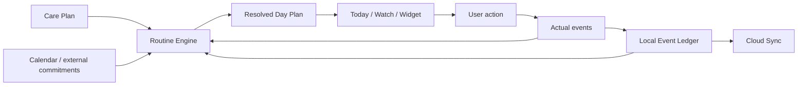

# NIDO — Family Routine OS

> **A calm, adaptive operating system for family routines.**
>
> NIDO is not a baby tracker, a static calendar, or a medical app. It is a local-first family routine engine that helps a caregiver answer four questions with almost no cognitive effort:
>
> **What matters now? What do I do? What happened? What changes next?**

## Status

**Phase:** product architecture / pre-development  
**Primary platform:** iPhone, native iOS  
**Secondary surfaces:** Apple Watch, widgets, Live Activities, Siri/App Intents  
**Core principle:** *reduce mental load; do not digitize it.*

## Product thesis

Most family-routine tools are built around one of three models:

1. a tracker that asks the caregiver to continuously log data;
2. a calendar that assumes the plan survives contact with reality; or
3. a content app that gives advice but does not operate the day.

NIDO uses a different model:

```text
PLAN → NOW → DO → OBSERVE → LOG → RECALCULATE → NEXT
```

The caregiver should not have to constantly re-plan a day after a late nap, a skipped meal, a doctor appointment, a difficult bedtime, a daycare report, or an unexpected outing. NIDO stores the intent of the routine, records what actually happened, and deterministically resolves the rest of the day inside explicit guardrails.

## The experience in one sentence

> NIDO should feel like a thoughtful second brain that quietly runs the timeline, while the caregiver remains fully in control.

## North-star product metric

**Mental load removed per day.**

Because this is difficult to measure directly, the operational proxy is:

- average interactions required per meaningful event: **≤ 2**;
- low unnecessary-notification rate;
- low manual rescheduling rate;
- high successful “what’s next?” resolution without navigation;
- continued use without increasing tracking burden.

## What NIDO is

- An adaptive family routine engine.
- A shared source of truth for planned routines and actual events.
- A low-friction logging system.
- A prioritization system for imperfect days.
- A private, local-first timeline that can work offline.
- A system surface across iPhone, Watch, widgets, Live Activities, Siri and Shortcuts.
- A framework for caregiver-approved programs such as gradual routine transitions.

## What NIDO is not

- A diagnostic medical system.
- A replacement for pediatricians, dietitians, lactation consultants, therapists or emergency services.
- A punitive habit tracker.
- A streak app.
- An AI scheduler that invents health or feeding instructions.
- A calendar that writes every snack, nap and game into the user’s personal calendar.
- A database that asks parents to log every sip, bite and emotion.

## Core loop



## Architecture at a glance

```text
Care Plan
  ├─ family goals
  ├─ caregiver preferences
  └─ locked professional instructions
          │
          ▼
Routine Engine (deterministic)
  ├─ priorities
  ├─ timing windows
  ├─ dependencies
  ├─ modes
  ├─ guardrails
  └─ explainable adjustment reasons
          │
          ▼
Resolved Day Plan
  ├─ Today
  ├─ Watch
  ├─ Widget
  ├─ Live Activity
  └─ Notification scheduler
          │
          ▼
Logged Event Ledger
  ├─ meals
  ├─ sleep
  ├─ nursing / milk
  ├─ health notes
  ├─ personal routines
  └─ household tasks
          │
          ├──► Insights
          └──► CloudKit sync
```

## Product surfaces

### Today
The primary interface. It answers: **what matters now?**

### Plan
A day/week view of resolved routine occurrences, meals, programs and household preparation.

### Insights
Descriptive, conservative summaries of patterns. It should distinguish correlation from causation and never diagnose.

### Quick Log
A global low-friction entry point for sleep, meals, nursing/milk, hydration, diaper, weight, note or voice input.

### Apple Watch
Only three jobs: **Now**, **Quick Log**, **Active timer/nap**.

### Widget / Lock Screen
Glanceable “now / next” information and explicit user actions.

## Repository map

```text
README.md
PROJECT_STATUS.md
AGENTS.md
LICENSE.md

docs/
  product/
    vision.md
    product-principles.md
    information-architecture.md
    user-stories.md
    feature-spec.md
    roadmap.md
    backlog.md
  design/
    design-system.md
    figma-handoff.md
    interaction-spec.md
    content-style.md
  architecture/
    system-architecture.md
    routine-engine.md
    domain-model.md
    event-ledger.md
    sync-collaboration.md
    apple-integrations.md
    intelligence.md
    notification-attention.md
  safety/
    safety-health-boundaries.md
    privacy-security.md
  engineering/
    ios-project-structure.md
    testing-strategy.md
    observability.md
  operations/
    decision-log.md
  adr/
    architectural decisions
  research/
    official-platform-references.md
examples/
  sample-care-plan.yaml
  sample-day.json
```

## MVP definition

The first version is successful if a caregiver can complete one whole imperfect day using NIDO without wanting to switch back to Notes.

The simulated acceptance day must include:

- a late morning nap;
- a small or rejected meal;
- a fixed external appointment;
- a shortened second nap;
- a comfort-feed exception;
- a good dinner;
- a bedtime adjustment;
- at least one action from Watch/widget/notification;
- no conflicting schedule between app surfaces.

## Initial technology direction

- **SwiftUI** — native UI.
- **SwiftData** — local persistence layer.
- **CloudKit / CKSyncEngine** — explicit synchronization adapter and eventual caregiver sharing.
- **EventKit** — calendar conflict awareness, permission-gated.
- **UserNotifications** — normal local reminders.
- **AlarmKit** — prominent alarms/timers only when explicitly justified and authorized.
- **ActivityKit** — active naps and selected running timers.
- **WidgetKit** — glanceable widgets, controls and watch complications.
- **App Intents** — actions exposed to Siri, Shortcuts, widgets and system surfaces.
- **Speech** — voice transcription.
- **Foundation Models** — structured interpretation, summaries and explanations; never the source of truth for scheduling or clinical decisions.

See [`docs/architecture/system-architecture.md`](docs/architecture/system-architecture.md) for the detailed design.

## Development doctrine

1. **The routine engine is deterministic and testable.**
2. **UI never calculates schedule logic.**
3. **Actual events never overwrite the original plan.**
4. **Every schedule adjustment is explainable.**
5. **AI proposes structured actions; domain validation commits them.**
6. **The app works offline.**
7. **No feature may increase caregiver burden merely to improve analytics.**
8. **No health-related rule may silently override a locked care instruction.**
9. **No alarm is scheduled merely because the API allows it.**
10. **A hard day must still feel like a successful day.**

## Working name

**NIDO** is provisional. It communicates home, care and calm without framing the product as only a baby tracker. Branding can change without affecting architecture.

## License

No open-source license is granted at this stage. See [`LICENSE.md`](LICENSE.md).
